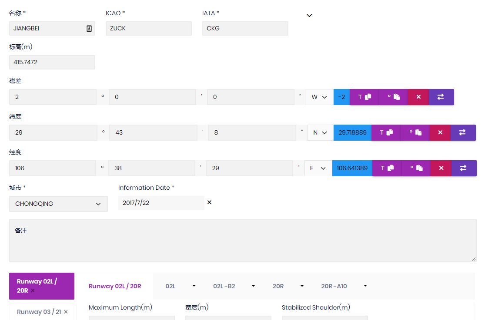
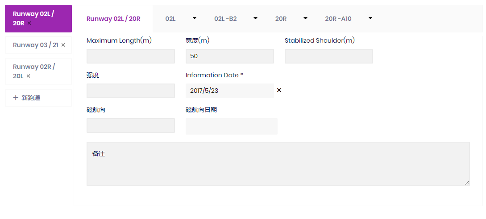
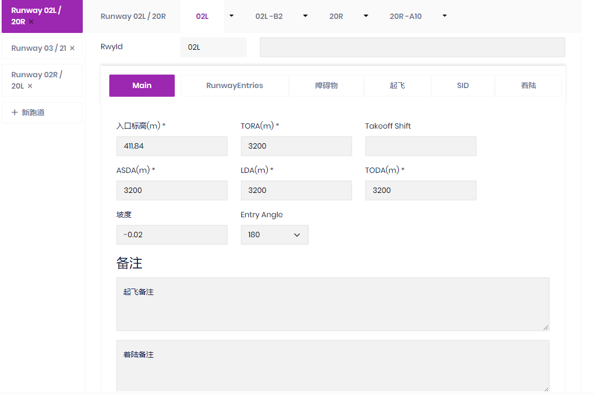
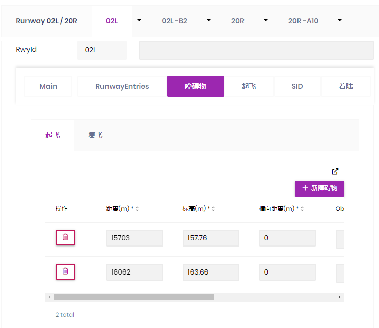
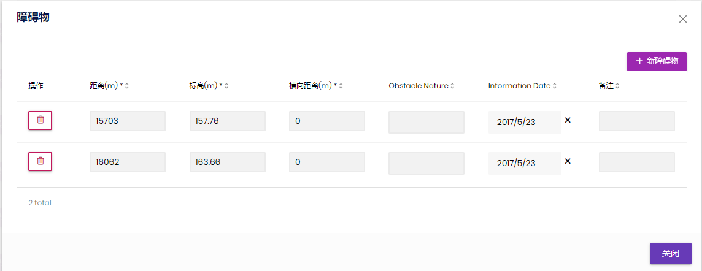
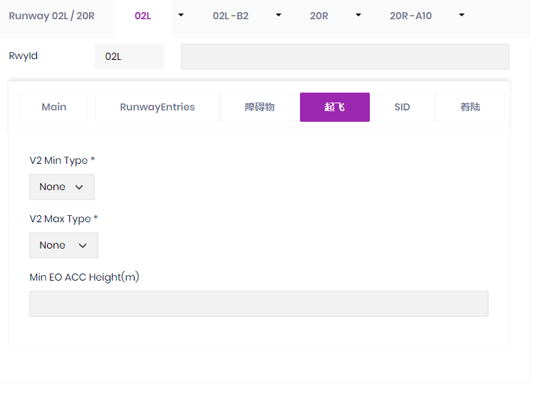
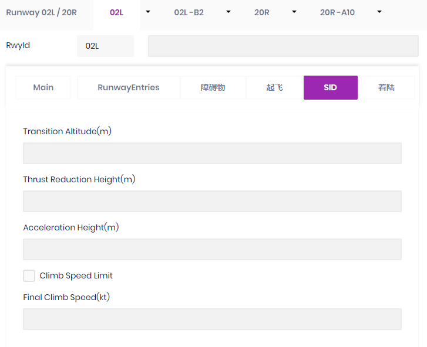
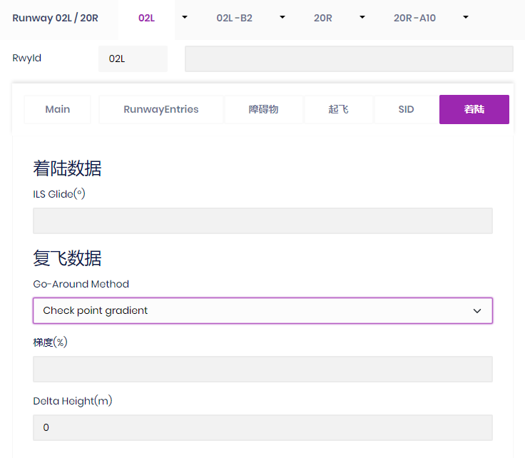
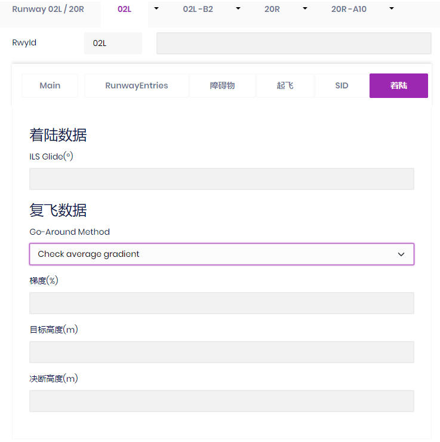
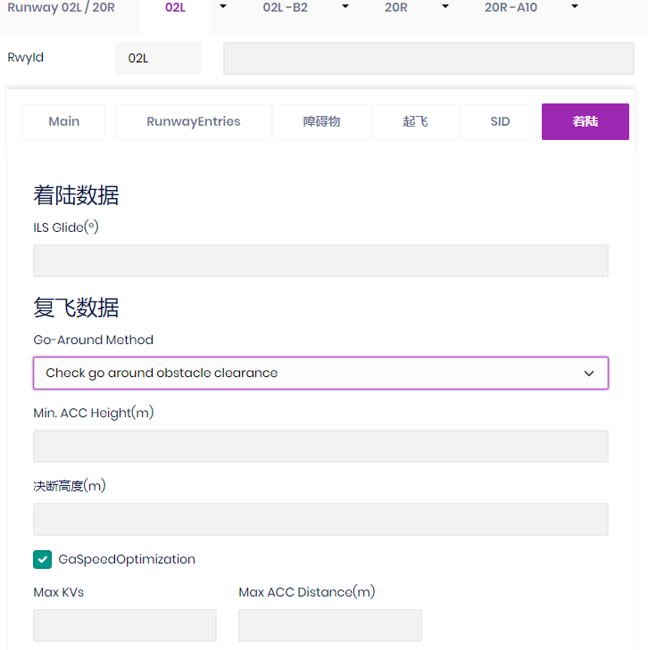

# PEP 机场库管理

空客性能软件机场管理模块 Airport Manager 的线上优化管理功能，与传统的 Airport Manager 客户端相比，数据存储在数据库上，不会出现不同电脑机场数据不一致的情况。

1. 机场数据编辑

   

2. 跑道数据编辑

   
   

3. 障碍物页数据编辑

   
   

4. 跑道起飞页数据编辑

   

5. 跑道 SID 页数据编辑

   

6. 跑道着陆页数据编辑

   
   
   
